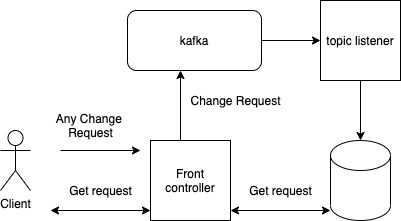
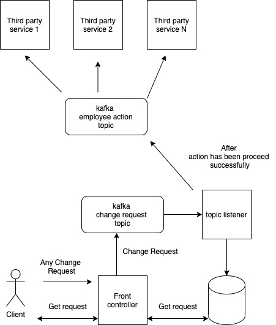

**Brief solution overview**:

 
 
 The following technologies have been used for implementation:
  1) Java 11
  2) Spring boot
  3) Hibernate
  4) Kafka
  5) Maven
  6) Docker
  7) NGINX
  

**How to build:**
        run in terminal: 
        
        sh build.sh

**How to run:**
  
  `local:`
        
        sh run-local.sh
        
        And run each application in IDE
    
  `uat:`
        
        sh run-uat.sh

**Access urls:**
   
   `local:`
        
        API doc in json format: http://localhost:8081/v2/api-docs
        API doc in human-readable format: http://localhost:8081/swagger-ui/
   
   `uat:`
        
        API doc in json format: http://localhost/api
        API doc in human-readable format: http://localhost/swagger-ui/   
        
 **Second Part (Optional but a plus):**
 
 Being concerned about developing high quality, resilient software, giving the fact, that you will be participating, mentoring other engineers in the coding review process.
 
 
 - Suggest what will be your silver bullet, concerns while you're reviewing this part of the software that you need to make sure is being there.
 - What the production-readiness criteria that you consider for this solution
 
 >To review
 
   First of all I have to check that following conditions regardless code are passed:
     
     1) Code is following the best practices, e.g. clean, readable, self-explanation and etc.
     
     2) There are unit test provided. At least non-trivial parts has been covered 
     
     3) The solution could be built and deployed simply 
 
 >Production-readiness criteria
    
    1) If there is definition of done criteria provided for the feature, the solution should be passed against them
    
    2) E2E test should be passed
    
    3) The solution should be deployed in the same way to the different environments (CI/CD)
    
    4) The solution could be monitored (provided configurations for monitorign tools, like ELK)
    
 
 **Third Part (Optional but a plus):**
 Another Team in the company is building another service, This service will be used to provide some statistics of the employees, this could be used to list the number of employees per country, other types of statistics which is very vague at the moment.
 
 
 - Please think of a solution without any further implementation that could be able to integrate on top of your service, including the integration pattern will be used, the database storage etc.
 
 A high-level architecture diagram is sufficient to present this.
 
 
 > Suggested solution
  
  To allow third party services integrate with current solution we can provide new topic in KAFKA
  and push enriched employee records and information about actions with employee
  
  Simple solutions could have the following diagram
 
 
 
 
    
    